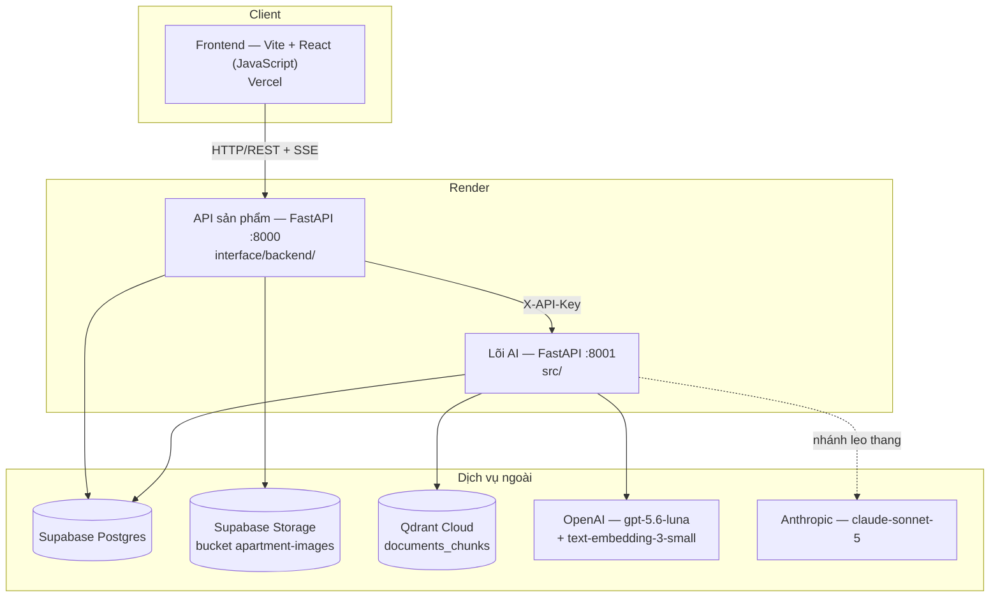
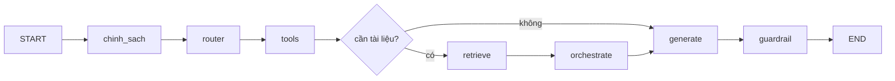
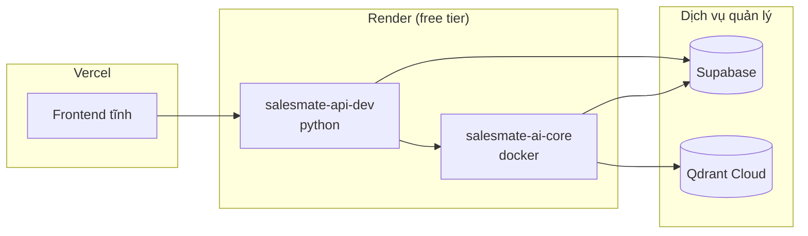

# Architecture Document — SalesMate (P-055)

> Bản này bám **code đang chạy**, không phải bản thiết kế dự định. Mọi mục dưới
> đây đối chiếu được với một file trong repo.
>
> Đào sâu hơn: toàn cảnh có sơ đồ ở
> [`docs/architecture_diagram.md`](docs/architecture_diagram.md) · lõi AI kèm
> chi phí đo thật ở [`docs/kien-truc-loi-ai.md`](docs/kien-truc-loi-ai.md) · quy
> ước làm việc ở [`CLAUDE.md`](CLAUDE.md) · lý do từng quyết định ở
> [`docs/adr/`](docs/adr/README.md).

## System Overview

Portal bất động sản xác thực (kiểu Meey Land) kèm trợ lý AI dạng widget nổi.
Người dùng công khai tìm căn, xem ảnh và hỏi trợ lý mà **không cần đăng nhập**;
sale và admin đăng nhập để quản lý lead, giao dịch và ảnh căn hộ.

Hệ thống chạy thành **ba tiến trình tách biệt**: frontend tĩnh, API sản phẩm, và
lõi AI. Lõi AI tách riêng vì nó là thứ duy nhất gọi model — tách ra thì đổi
agent không phải deploy lại portal, và trần chi phí đặt được ở đúng một chỗ.

## Architecture Diagram

Frontend **không bao giờ** gọi thẳng lõi AI. Mọi đường đi qua API sản phẩm, vì
đó là nơi duy nhất có danh tính người dùng để chặn quyền và đếm hạn mức.

## Components

### 1. Frontend — Vite + React

- **Purpose:** portal tìm kiếm căn hộ + widget chat + màn quản trị cho sale/admin
- **Ngôn ngữ:** JavaScript thuần — **không có TypeScript** trong dự án này
- **State:** `AuthContext` (React Context) giữ `user`/`role`/`token`; không dùng
  Redux/Zustand — phạm vi state chung chỉ có phiên đăng nhập
- **Gọi API:** mọi lời gọi đi qua `src/api/client.js`, không `fetch` rải rác
- **Streaming:** `fetch` + `ReadableStream`, **không** `EventSource` — chat là
  `POST` mà `EventSource` chỉ gửi được `GET`
- **Style:** biến CSS trong `src/styles/global.css`, không hardcode trong component

### 2. API sản phẩm — FastAPI (`interface/backend/`)

- **Purpose:** auth, căn hộ, phân khu, ảnh, lead đặt cọc, giao dịch; và **cầu**
  sang lõi AI cho chat với tài liệu
- **API Design:** RESTful, prefix `/api`
- **Authentication:** JWT (HS256, hạn 480 phút), RBAC ba vai `admin`/`sale`/`user`
- **Phân quyền:** thực thi ở `app/core/deps.py` — **nơi duy nhất**; frontend ẩn
  nút chỉ là UX
- **Với chat:** chỉ **dẫn ống** SSE, cố ý không parse event — loại event mới
  thêm ở lõi AI tự chảy qua mà không phải sửa backend

### 3. AI Agent — LangGraph (`src/`)

- **Agent Type:** state machine LangGraph. Mặc định chạy **pipeline tất định**;
  cổng leo thang mở sang vòng lặp tool-calling khi cần
- **Nodes:** `chinh_sach` · `router` · `tools` · `retrieve` · `orchestrate` ·
  `generate` · `guardrail` (thêm `plan`/`act` khi bật `ENABLE_AGENT_LOOP`)
- **Tools:** `inventory_lookup` · `inventory_search` · `inventory_summary` ·
  `so_sanh_can` · `tinh_khoan_vay` · `dat_coc`
- **Flow (mặc định):**

`chinh_sach` chỉ bắn một task chạy nền rồi trả về ngay (~0ms); nó được `await`
ngay trước `generate` — thời điểm muộn nhất còn chặn được, vì trên đường stream
token đã gửi là khách đã đọc.

- **Phân bổ model:** router/gợi ý/trả lời dùng `gpt-5.6-luna` ($0,20–1,20 /1M);
  orchestrator và cổng chính sách dùng `claude-sonnet-5` ($2–10 /1M). Bảng giá ở
  [`src/core/gia_model.py`](src/core/gia_model.py), mỗi mục có cờ `da_xac_minh`
- **Chi phí đo thật:** $0,0027–0,0049 mỗi lượt khi prompt cache ấm

### 4. Database — Supabase Postgres

- **Type:** PostgreSQL (Supabase), kết nối qua transaction pooler
- **Tables:** `salemate_v1` (tồn kho gốc) · `users` · `zones` · `towers` ·
  `apartment_images` · `sales_history` · `dat_coc_lead` · `documents`
- **View:** `inventory_units` là **VIEW** trên `salemate_v1`, không phải bảng sao
  chép — bản sao cũ đã trôi lệch 4 căn sai giá
- **Migrations:** file SQL đánh số trong
  [`interface/backend/migrations/`](interface/backend/migrations/), chạy tay.
  **Không dùng Alembic.** Trên Postgres, migration là nguồn sự thật duy nhất của
  schema — code không được tự `CREATE TABLE`
- **RLS:** bật trên bảng chứa dữ liệu cá nhân; `service_role_key` bỏ qua RLS nên
  chỉ dùng ở server

### 5. Vector Store — Qdrant Cloud

- **Type:** Qdrant Cloud, collection `documents_chunks` — xem
  [ADR-001](docs/adr/ADR-001-qdrant.md)
- **Embeddings:** `text-embedding-3-small`, 1536 chiều (BGE-M3 tính sau —
  [ADR-002](docs/adr/ADR-002-embedding-tieng-viet.md))
- **Nội dung:** **chỉ** `doc_kind="policy"` — 11 tài liệu / 39 chunk, khớp
  một-đối-một với `data/raw/knowledge/`
- **Purpose:** RAG cho câu hỏi về **quy tắc** (chính sách, pháp lý, tiện ích)

⚠️ **Giá và tình trạng căn KHÔNG đi qua vector store.** Chúng ở Postgres, tool
đọc trực tiếp lúc hỏi. RAG luôn là bản chụp; giá đổi hàng ngày. Trộn hai đường
là tự tạo hai nguồn số liệu lệch nhau — 871 chunk tin rao đã bị gỡ vì đúng lỗi đó.

## Data Flow

Một lượt hỏi có tài liệu:

1. Widget `POST /api/chat/stream` kèm câu hỏi + 10 lượt lịch sử gần nhất
2. API sản phẩm kiểm hạn mức (khách 15 lượt/ngày · nhân viên 120 lượt/10 phút),
   rồi gọi lõi AI kèm `X-API-Key`
3. Lõi AI kiểm khoá dịch vụ + phanh chi phí, mở SSE
4. `chinh_sach` bắn task phân loại chạy nền; `router` gán nhãn và giải tham chiếu
   từ lịch sử
5. `tools` chạy tool khai phục vụ nhãn đó → đọc Postgres theo thời gian thực
6. `retrieve` truy hồi chunk từ Qdrant, tính độ phủ
7. Cổng chính sách được `await`; bị chặn thì cắt tại đây
8. `generate` sinh câu trả lời — **số liệu tool đứng trước tài liệu** trong prompt
9. `guardrail` kiểm độ phủ, lọc nguồn "đã dùng" (không phải "đã tra cứu"), phát
   event `sources` rồi `done`
10. API sản phẩm dẫn nguyên ống về; frontend hiện chữ dần + dòng "Nguồn" bấm được

## Deployment Architecture

- **Chỉ deploy nhánh `develop`.** `main` còn là bản cũ chưa có `interface/`
- **Một Supabase project dùng chung** cho mọi môi trường — sửa dữ liệu khi test
  là người dùng thấy ngay, và chạy migration là chạy thẳng lên production
- Có **repo mirror** cá nhân chỉ để Render/Vercel đọc; repo org vẫn là nguồn sự
  thật duy nhất. Đồng bộ bằng `make sync-deploy`
- Chi tiết: [DEPLOY.md](DEPLOY.md)

## Security

- Secret chỉ ở `.env` (đã gitignore) và Render dashboard — không bao giờ commit
- **JWT** cho người dùng; đọc lại user từ DB mỗi request nên thu hồi quyền có
  hiệu lực ngay, không phải chờ token hết hạn
- **Phân quyền theo quyền sở hữu, không chỉ theo vai trò** — câu ghi lead mang
  luôn mệnh đề `sale_id`, và 404 không phân biệt "không tồn tại" với "không
  thuộc quyền"
- **Khoá dịch vụ giữa hai service** (`X-API-Key`, so bằng `compare_digest`): lõi
  AI có URL công khai và là chỗ tốn tiền model. Thiếu khoá trên `production` thì
  chặn hết — xem [`src/api/bao_ve.py`](src/api/bao_ve.py)
- **Hạn mức hai tầng:** portal đếm theo người dùng/IP; lõi AI có phanh riêng đếm
  cho cả tiến trình. Tầng dưới không được phụ thuộc tầng trên
- **Chống prompt injection:** nội dung tài liệu bị vô hiệu hoá thẻ đóng
  `</ngu_canh>` trước khi vào prompt, kèm luật trong system prompt
- Validate input bằng Pydantic; CORS khai tường minh theo domain frontend
- Không lộ stack trace ra ngoài; số điện thoại khách **không** vào `data` của
  tool vì `data` đi vào prompt rồi vào log nhà cung cấp LLM

## Design Decisions

| Decision | Choice | Reason |
|---|---|---|
| Framework | FastAPI | Async, auto-docs, type-safe |
| Agent | LangGraph | State machine rẽ nhánh được, thêm vòng lặp không phải viết lại |
| Tách lõi AI thành service riêng | 2 service | Đổi agent không deploy lại portal; trần chi phí model ở một chỗ |
| Cách ly giữa 4 người | Protocol + container | Chỉ import `contracts.py`/`models/`, không import class cụ thể — [ADR-004](docs/adr/ADR-004-module-contracts.md) |
| Database | Supabase Postgres | Có sẵn Storage + RLS, gói free đủ dùng |
| Migration | File SQL đánh số | `ensure_table()` của code từng tạo bảng thiếu RLS trên production |
| Vector store | Qdrant Cloud | Lọc thuộc tính ngay trong truy vấn vector — [ADR-001](docs/adr/ADR-001-qdrant.md) |
| Embedding | `text-embedding-3-small` | Tiếng Việt đủ tốt, không kéo torch ~2GB — [ADR-002](docs/adr/ADR-002-embedding-tieng-viet.md) |
| Reranker | `KeywordOverlapReranker` | `cross_encoder` cần torch, không vừa Render free |
| Frontend | Vite + React (JS) | Build nhanh, deploy tĩnh; không TypeScript để 4 người không phải đồng bộ type |
| Giá & tình trạng căn | Tool đọc Postgres | RAG là bản chụp; hai nguồn số liệu là hai con số lệch nhau |
| Model trả lời | `gpt-5.6-luna` | Đo 29 câu golden ngày 26/08/2026: 17 đạt / 2 không đạt, trích nguồn đầy đủ |

## Nợ kỹ thuật đã biết

Ghi ở [`JOURNAL.md`](JOURNAL.md) mục "Nợ kỹ thuật" — đáng chú ý nhất: phân quyền
**chưa nối** tới tầng truy hồi (`RetrieveNode` ghim cứng `["public"]`), vì
`ChatRequest` không mang danh tính người dùng mà `src/models/` đóng băng.
