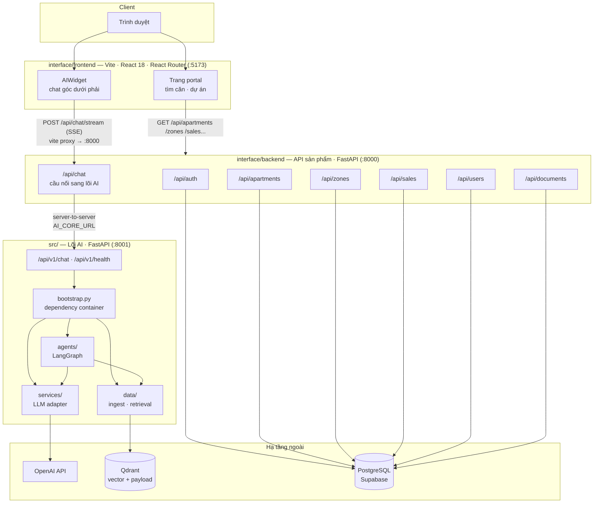
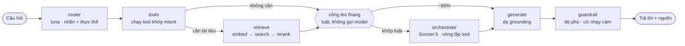
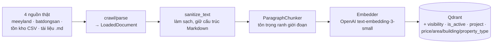
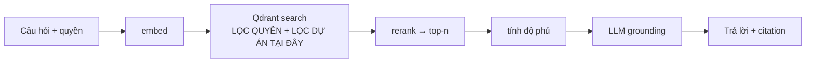
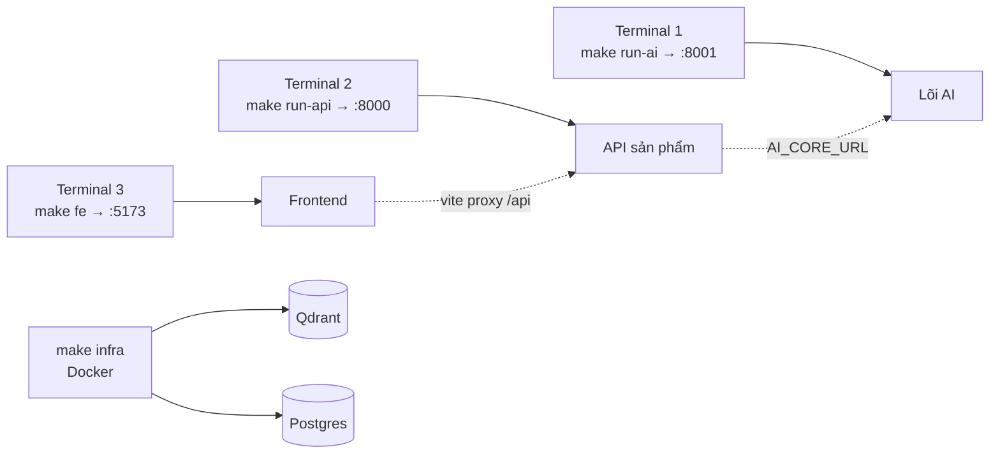

# Kiến trúc hệ thống — SalesMate

> Cập nhật theo kiến trúc **3 service** đang chạy thật (xem `RUN.md`,
> `Makefile`, `.env.example`) — không phải bản Next.js một backend mô tả ở
> phiên bản tài liệu trước.

## 1. Tổng quan

**Điểm mấu chốt:**

- **2 backend độc lập, không phải 1.** `interface/backend` (:8000) là API sản
  phẩm — auth, tồn kho căn hộ, khu/toà, lịch sử bán, tài liệu. `src/` (:8001)
  là lõi AI — agent graph + RAG, không biết gì về auth/CRUD. `interface/backend`
  gọi sang lõi AI qua HTTP server-to-server bằng biến `AI_CORE_URL`; frontend
  **không bao giờ** gọi thẳng cổng 8001.
- `bootstrap.py` (trong `src/`) là nơi duy nhất gắn interface với
  implementation của lõi AI. Mọi module trong `src/` chỉ phụ thuộc
  `contracts.py` của nhau, nên đổi Qdrant / embedder / LLM provider chỉ sửa
  một dòng. Xem [ADR-004](adr/ADR-004-module-contracts.md).
- Frontend không gọi thẳng `:8000` bằng URL tuyệt đối — dev server Vite proxy
  `/api/*` sang `http://localhost:8000` (xem `interface/frontend/vite.config.js`),
  nên code frontend chỉ cần biết đường dẫn tương đối.

## 2. Luồng agent (bên trong lõi AI, `src/agents/graph.py`)

State machine chứ không phải chain thẳng: router rẽ nhánh theo intent, tool
chạy trước khi quyết định có cần truy hồi tài liệu hay không (tool đọc nguồn
sự thật lúc hỏi — giá/tình trạng căn; vector store chỉ là bản chụp).

**Guardrail** là chốt chặn: độ phủ dưới ngưỡng thì thay câu trả lời bằng thông
điệp "chưa đủ dữ liệu" — **trừ khi** đã có kết quả tool thật (không từ chối dù
độ phủ 0 khi tool đã trả lời đúng).

📖 **Chi tiết đầy đủ ở [`kien-truc-loi-ai.md`](kien-truc-loi-ai.md)**: trách
nhiệm từng node, ba luật leo thang, phân bổ model kèm chi phí đo thật, hợp đồng
Protocol, và danh sách bẫy đã gặp. Mục này chỉ giữ mức toàn cảnh — sửa chi tiết
thì sửa ở tài liệu kia, đừng chép sang đây.

## 3. Luồng dữ liệu RAG (`src/data/`)

**Ingest (ghi) — một dòng lệnh duy nhất, xem `python -m src.cli`:**

Nạp lại cùng `doc_id` sẽ thay bản cũ — chỉ giữ bản đang hiệu lực. Tin bị gỡ
khỏi site nguồn thì đánh `is_active=False` (giữ lịch sử) thay vì xoá.

**Query (đọc):**

Phân quyền (`public`/`internal`) và phân dự án (OCP1/OCP2/OCP3, tránh lẫn khu)
lọc **tại truy vấn vector**, không lọc ở tầng giao diện — tài liệu nội bộ
không bao giờ lọt vào context của LLM. Xem [ADR-001](adr/ADR-001-qdrant.md).

## 4. Sự kiện SSE (`/api/chat/stream` ở cả 2 backend)

Widget nhận luồng `text/event-stream`, mỗi message là một JSON:

| Event | Khi nào | Dùng làm gì |
|---|---|---|
| `start` | mở luồng | nhận `session_id` |
| `route` | sau router | hiện nguồn định tuyến |
| `token` | mỗi mảnh chữ | hiệu ứng gõ dần |
| `sources` | sau truy hồi | chip trích nguồn |
| `done` | kết thúc | mở lại ô nhập |
| `error` | có lỗi | hiện thông điệp tiếng Việt |

## 5. Thành phần và lựa chọn công nghệ

| Lớp | Công nghệ | Lý do |
|---|---|---|
| Frontend | Vite · React 18 · React Router (JS thuần, không TypeScript/Tailwind) | Đơn giản, khởi động nhanh, không cần build phức tạp cho MVP |
| API sản phẩm | FastAPI · Pydantic v2 (`interface/backend/`) | Tách khỏi lõi AI — auth/CRUD không phụ thuộc LLM, deploy độc lập |
| Lõi AI | FastAPI · LangGraph (`src/`) | State machine có rẽ nhánh và vòng lặp cho câu hỏi nhiều bước |
| Vector | Qdrant Cloud | Payload filtering cho phân quyền — [ADR-001](adr/ADR-001-qdrant.md) |
| Embedding | OpenAI `text-embedding-3-small` → BGE-M3 | Cân giữa chất lượng và chi phí — [ADR-002](adr/ADR-002-embedding-tieng-viet.md) |
| LLM | Hai tầng: rẻ cho router, mạnh cho câu trả lời | [ADR-003](adr/ADR-003-model-routing.md) |
| DB | PostgreSQL (Supabase) | Dữ liệu có cấu trúc: user, căn hộ, lịch sử bán, tài liệu |
| Quan sát | Structured JSON log · LangSmith | Truy vết từng bước agent |

## 6. Chạy local (3 terminal, xem `RUN.md`)

Cả `interface/backend` và `src/` đọc **chung một file `.env`** ở gốc repo —
không có `.env` riêng cho từng service (xem `.env.example`).
