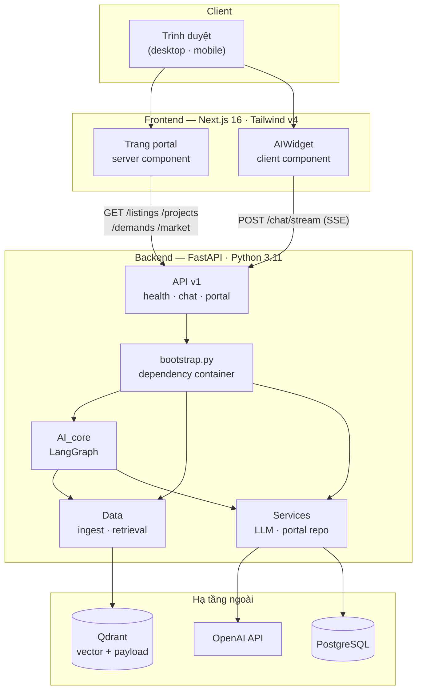
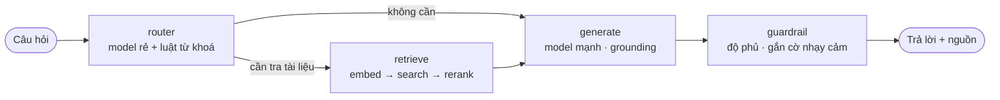
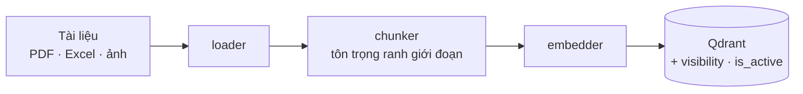
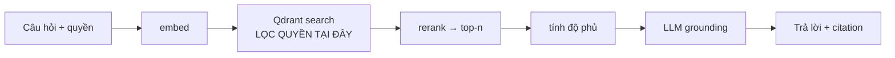
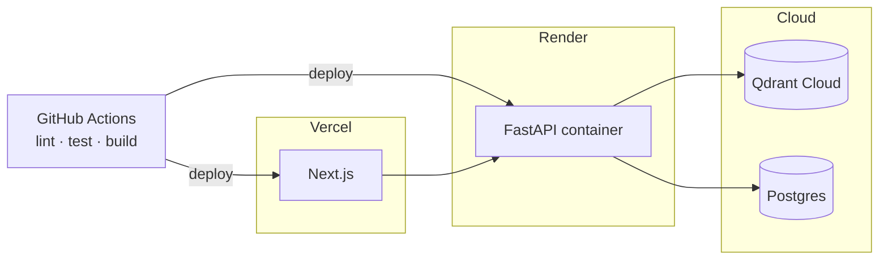

# Kiến trúc hệ thống — SalesMate

## 1. Tổng quan

**Điểm mấu chốt:** `bootstrap.py` là nơi duy nhất gắn interface với
implementation. Mọi module chỉ phụ thuộc `contracts.py` của nhau, nên đổi
Qdrant / embedder / LLM provider chỉ sửa một dòng. Xem
[ADR-004](adr/ADR-004-module-contracts.md).

## 2. Luồng agent

State machine chứ không phải chain thẳng: router rẽ nhánh, và về sau thêm được
vòng lặp (truy hồi lại khi độ phủ thấp) mà không phải viết lại cấu trúc.

**Guardrail** là chốt chặn: độ phủ dưới ngưỡng thì thay câu trả lời bằng thông
điệp "chưa đủ dữ liệu" thay vì để LLM suy đoán.

## 3. Luồng dữ liệu

**Ingest (ghi):**

Nạp lại cùng `doc_id` sẽ thay bản cũ — chỉ giữ bản đang hiệu lực.

**Query (đọc):**

Phân quyền lọc **tại truy vấn vector**, không lọc ở tầng giao diện — tài liệu nội
bộ không bao giờ lọt vào context của LLM. Xem
[ADR-001](adr/ADR-001-qdrant.md).

## 4. Sự kiện SSE

Widget nhận luồng `text/event-stream`, mỗi message là một JSON:

| Event | Khi nào | Dùng làm gì |
|---|---|---|
| `start` | mở luồng | nhận `session_id` |
| `route` | sau router *(bật cùng RAG)* | hiện nguồn định tuyến |
| `token` | mỗi mảnh chữ | hiệu ứng gõ dần |
| `sources` | sau truy hồi *(bật cùng RAG)* | chip trích nguồn |
| `done` | kết thúc | mở lại ô nhập |
| `error` | có lỗi | hiện thông điệp tiếng Việt |

Hợp đồng đã có đủ 6 event từ đầu, nên khi bật RAG thì FE không phải đổi gì.

## 5. Thành phần và lựa chọn công nghệ

| Lớp | Công nghệ | Lý do |
|---|---|---|
| Frontend | Next.js 16 (App Router) · TypeScript · Tailwind v4 | Streaming tốt, token thiết kế tập trung |
| Backend | FastAPI · Pydantic v2 | Async, tự sinh OpenAPI, validate mạnh |
| Agent | LangGraph | State machine có rẽ nhánh và vòng lặp |
| Vector | Qdrant | Payload filtering cho phân quyền — [ADR-001](adr/ADR-001-qdrant.md) |
| Embedding | OpenAI → BGE-M3 | Cân giữa chất lượng và kích thước image — [ADR-002](adr/ADR-002-embedding-tieng-viet.md) |
| LLM | Hai tầng: rẻ cho router, mạnh cho câu trả lời | [ADR-003](adr/ADR-003-model-routing.md) |
| DB | PostgreSQL | Dữ liệu có cấu trúc: giá, tài liệu/version, log |
| Quan sát | Structured JSON log · LangSmith | Truy vết từng bước agent |

## 6. Triển khai

Local: `make infra` bật Qdrant + Postgres bằng Docker; `make run` chạy backend;
`make fe` chạy frontend.
