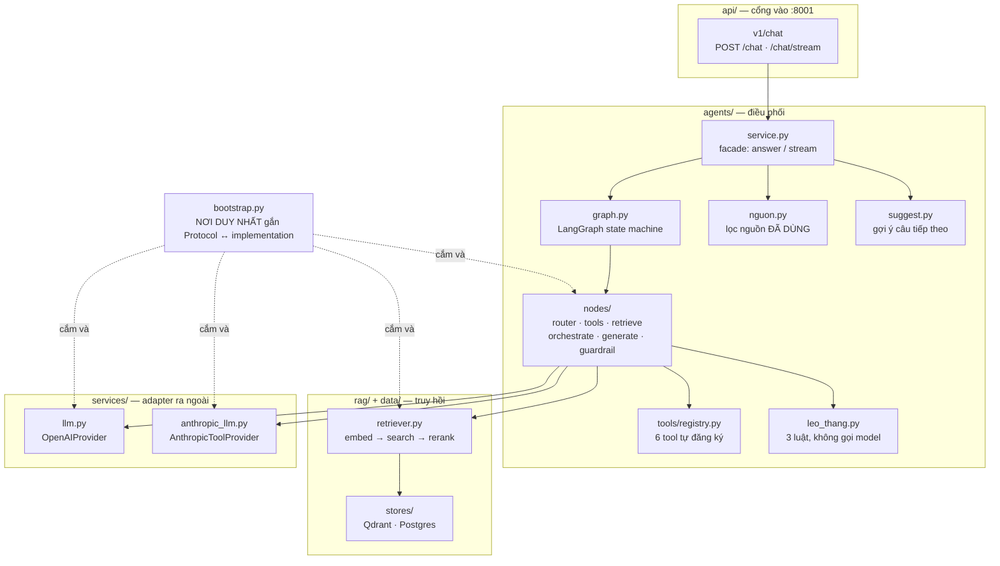
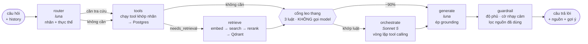
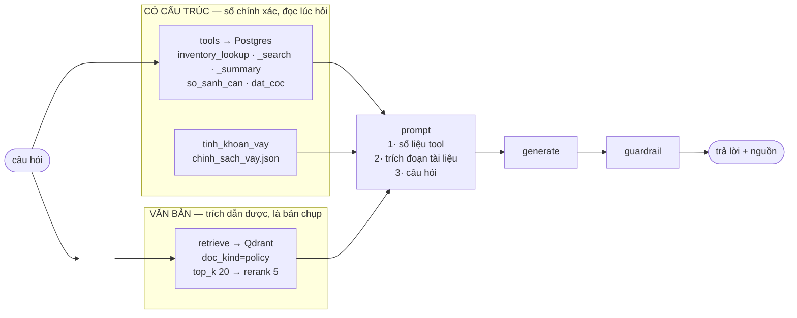
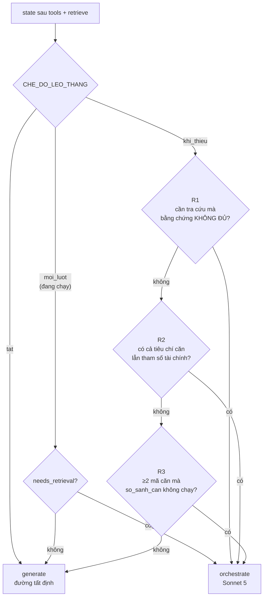

# Kiến trúc Lõi AI (`src/`)

> Đào sâu vào service `:8001`. Bản toàn cảnh ba service ở
> [`architecture_diagram.md`](architecture_diagram.md); quy ước làm việc ở
> [`../CLAUDE.md`](../CLAUDE.md).
>
> Mọi con số chi phí và độ trễ trong tài liệu này **đo trên máy thật**, không
> phải ước tính.

---

## 1. Ba nguyên tắc quyết định mọi thứ còn lại

| | Nguyên tắc | Hệ quả kiến trúc |
|---|---|---|
| 1 | **Không bịa số** | Giá và tình trạng căn đi qua tool → Postgres. Không bao giờ qua vector store. |
| 2 | **Luôn trích nguồn** | Mọi khẳng định lấy từ tài liệu phải kèm nguồn, và nguồn phải là thứ **đã dùng** chứ không phải đã tra. |
| 3 | **Quyết sau khi có bằng chứng** | Không nhánh nào được chọn dựa trên *dự đoán* độ khó. Cổng leo thang chạy sau khi đã gom dữ liệu. |

Nguyên tắc 3 là bài học đắt nhất của dự án. Xem [§11 — Bẫy đã gặp](#11-bẫy-đã-gặp).

---

## 2. Toàn cảnh module



**Quy tắc phụ thuộc:** module chỉ import `contracts.py` và `models/` của module
khác. Không bao giờ import class cụ thể (`QdrantVectorStore`, `OpenAIProvider`…).
Lý do ở [ADR-004](adr/ADR-004-module-contracts.md).

---

## 3. Luồng một lượt hỏi



Điểm cần nắm:

- **`tools` nằm trên đường đi CHUNG**, không phải một nhánh rẽ. Nó tự thoát khi
  không tool nào nhận nhãn hiện tại. Nhờ vậy thêm tool mới không phải sửa
  `graph.py`.
- **`retrieve` bó vào `doc_kind="policy"`** khi nhãn là `LEGAL`/`DOCUMENT` hoặc
  khi tool đã có dữ liệu — lúc đó số liệu căn đã lấy từ Postgres, việc còn lại
  của truy hồi là tìm *quy tắc*.
- **Cổng leo thang nằm TRONG `OrchestratorNode`**, không phải ở cạnh điều kiện.
  Để ngoài thì `build_graph` phải nhận `Settings` chỉ để đọc ba cờ, và đường
  stream lại phải chép lại cùng logic.
- **`generate` nhận số liệu tool TRƯỚC tài liệu** trong prompt: tool đọc nguồn
  sự thật lúc hỏi, vector store chỉ là bản chụp.

### Trách nhiệm từng node

| Node | Việc | Ghi ra state | Log tóm tắt |
|---|---|---|---|
| `router` | Luật từ khoá trước, model rẻ sau. Rút thực thể nếu có lịch sử. | `intent` · `needs_retrieval` · `entities` | `nhãn=listing · cần tra cứu · giải tham chiếu: gia_max, phan_khu` |
| `tools` | Chạy tool khai phục vụ nhãn hiện tại | `tool_context` · `tool_citations` · `tools_ran` · `tool_filters` | `inventory_search(price_max=4.0, …) → có dữ liệu` |
| `retrieve` | Chỉ gọi `Retriever` Protocol, không biết gì về Qdrant | `chunks` · `coverage` · `da_truy_hoi` | `5 đoạn / 3 tài liệu · độ phủ 0.752` |
| `orchestrate` | Tự gác cổng; khớp luật thì chạy vòng lặp tool calling | `leo_thang` · cộng dồn vào `tool_context` · token | `leo thang R1 · claude-sonnet-5 · tool: inventory_search` |
| `generate` | Model sinh câu trả lời, có context thì ép grounding | `answer` | `model=gpt-5.6-luna · sinh 984 ký tự` |
| `guardrail` | Độ phủ thấp → "chưa đủ dữ liệu"; gắn cờ nhạy cảm; lọc nguồn | `answer` · `citations` · `is_sensitive` | `giữ câu trả lời · 3 nguồn sau khi lọc` |

Thêm node: kế thừa `BaseNode`, chỉ viết `execute()` — try/except, log, đo thời
gian đã có ở lớp cha. Khai thêm `tom_tat()` để node tự nói mình vừa làm gì.
Node **không** trả khoá `metadata`, lớp cha đang dùng khoá đó.

---

## 4. Hai nguồn dữ liệu, cố ý không trộn

Đây là hình quan trọng nhất của lõi AI.



| Loại dữ liệu | Nguồn sự thật | Vì sao |
|---|---|---|
| Giá, diện tích, tình trạng, hướng, tầng | **Postgres** (`inventory_units`) | Đổi hàng ngày. RAG luôn là bản chụp cũ. |
| Trần lãi suất, số tháng khoá, `hieu_luc_den` | **`chinh_sach_vay.json`** | Đã đo được model bịa "ngân hàng cho vay 70-80%" khi rút số từ văn xuôi. |
| Chính sách, ưu đãi, tiện ích, pháp lý | **Qdrant** (`doc_kind="policy"`) | Văn bản dài, cần trích dẫn nguyên văn. |

`inventory_units` là **VIEW** trên `salemate_v1`, nên chatbot và portal luôn nói
cùng một con số. Trước đó nó là bảng sao chép và đã trôi lệch 4 căn sai giá.

**Qdrant chỉ chứa `doc_kind="policy"`.** Ba nguồn tin rao cũ (`meeyland` 695
chunk, `batdongsan` 76, `inventory` 100) đã bị gỡ: hai nguồn đầu là tin rao của
sàn khác, nguồn thứ ba nhân bản tồn kho Postgres — đúng hai điều nguyên tắc 1
vừa cấm.

---

## 5. Cổng leo thang

Bật bằng `ENABLE_ORCHESTRATOR`. Cổng có **ba chế độ**, chọn bằng
`CHE_DO_LEO_THANG`:



| Chế độ | Sonnet 5 chạy khi | Dùng khi |
|---|---|---|
| `tat` | không bao giờ | Muốn đường tất định thuần, không tốn Anthropic |
| `khi_thieu` | một trong ba luật hẹp khớp | Chỉ coi orchestrator là lưới an toàn |
| `moi_luot` | **mọi câu cần tra cứu** — đang chạy | Orchestrator là một TẦNG thật của agent |

**Vì sao mặc định là `moi_luot`.** Bản đầu chỉ có `khi_thieu`, và đo trên máy
thật thì nó khớp **0/8** câu điển hình: R1 đòi độ phủ dưới ngưỡng mà
`KeywordOverlapReranker` cho điểm rộng tay (0,468–0,888 cả với đoạn không liên
quan), còn R2/R3 đọc thực thể vốn rỗng ở câu một lượt. Một tính năng không bao
giờ chạy thì không khác gì không có.

Bài học: **chạy rộng trước rồi thu hẹp theo số đo**. Hẹp sẵn thì không có dữ
liệu nào để biết nên nới bao nhiêu; rộng thì bộ đếm ngân sách
([§10](#chi-phí)) và log nói ngay khi phải siết.

Câu xã giao (`needs_retrieval=False`) vẫn không leo thang ở mọi chế độ — gọi
model đắt tiền chỉ để nghe nó nói "không cần tool nào" là tiêu tiền vô ích.

### Ba luật của `khi_thieu`

| Luật | Mặc định | Chữa ca |
|---|---|---|
| `R1` | **bật** | Đúng nhánh `GuardrailNode` sắp trả "chưa đủ dữ liệu" |
| `R2` | tắt | Chuỗi tool phụ thuộc: tìm căn rồi mới tính vay theo giá căn đó |
| `R3` | tắt | "So sánh VOP345 với VOP397, căn nào vay lợi hơn" |

Mỗi luật một cờ riêng (`LEO_THANG_R1/R2/R3`) — bật cả ba cùng lúc thì lúc chi
phí vọt lên không biết luật nào gây ra.

**R1 dùng ĐÚNG phép kiểm của `GuardrailNode._has_enough_context`**, không được
tự nghĩ ra phép kiểm riêng. Hai bên hiểu "đủ dữ liệu" khác nhau là cách chắc
chắn nhất để cổng vô dụng — xem [§11](#11-bẫy-đã-gặp).

### Vòng lặp orchestrator

`OrchestratorNode` dùng **tool calling gốc** của Sonnet 5 (`tool_use` đúng chuẩn
API), khác `PlanNode` cũ vốn bảo model viết quyết định bằng chữ rồi parse chuỗi.

Bốn chốt chặn giữ nguyên từ vòng lặp cũ:

| Chốt | Chặn chuyện gì |
|---|---|
| `orchestrator_max_iterations` (3) | Model đòi gọi tool mãi |
| Tool phải có trong registry | Spec lệch registry sau một lần refactor |
| `da_thu` — không lặp lại hành động | Agent kẹt, xin đi xin lại một thứ |
| `_lam_sach` — bỏ tham số rỗng | `""` dịch thành `ILIKE ''`, không khớp gì |

Node **không bao giờ raise**: lỗi nhà cung cấp, hết quota, mạng đứt đều bị nuốt
và đi tiếp sang `generate` với bằng chứng đã gom. Một tính năng phụ không được
làm câm cả trợ lý.

**Hai đường vào phải sinh nguồn GIỐNG NHAU.** `_BangChung.them()` gọi lại chính
`_nguon_cua_tool` của `ToolsNode`, không tự dựng `Citation`. Bản đầu chép cách
làm đơn giản của `ActNode` (lấy câu đầu trong description làm nhãn) và tái tạo
đúng một lỗi dự án đã sửa — xem [§11](#11-bẫy-đã-gặp).

`da_thu` cũng được nạp sẵn chữ ký các tool mà `ToolsNode` vừa chạy trong cùng
lượt, nếu không thì chốt chống lặp chỉ phủ vòng lặp của orchestrator và cùng một
tool chạy hai lần trong một câu hỏi.

---

## 6. Phân bổ model và chi phí thật

| Vai | Model | $/1M vào–ra | Đo được mỗi lượt |
|---|---|---|---|
| router (nhãn + giải tham chiếu), gợi ý | `gpt-5.6-luna` | 0.20 – 1.20 | ~$0.0002 |
| sinh câu trả lời | `gpt-5.6-luna` | 0.20 – 1.20 | ~$0.0013 |
| orchestrator | `claude-sonnet-5` | 2.00 – 10.00 | **$0.0027 – $0.0049** (cache ấm) · $0.0131 (lượt ghi cache) |
| embedding | `text-embedding-3-small` | 0.02 – 0 | ~$0 |

Bảng giá ở [`src/core/gia_model.py`](../src/core/gia_model.py), mỗi mục có cờ
`da_xac_minh` — mục chưa xác minh vẫn tính được nhưng ghi WARNING.

> ⚠️ Sonnet 5 đang ở **giá giới thiệu**, hết **31/08/2026** rồi về 3.00 – 15.00.

### Ràng buộc riêng của từng họ model

Cả hai model mới đều bỏ tham số lấy mẫu — sai là 400 hoặc hỏng câm:

| | `gpt-5.6-luna` | `claude-sonnet-5` |
|---|---|---|
| `temperature` | **400** ở mọi giá trị | **400** ở giá trị khác mặc định |
| Hạn mức đầu ra | `max_completion_tokens`, **không** phải `max_tokens` | `max_tokens` như cũ |
| Token suy luận | Tính vào hạn mức đầu ra, **không hiện ra nội dung** → sàn 1024 | Adaptive thinking bật mặc định, tính theo giá đầu ra → `effort=low` |

Hai ràng buộc đầu trả 400 nên khó bỏ sót. **Ràng buộc thứ ba hỏng câm** và là
lỗi tốn nhiều thời gian nhất — xem [§11](#11-bẫy-đã-gặp).

Xử lý tập trung ở `_tham_so_model()` trong
[`src/services/llm.py`](../src/services/llm.py), để chỗ gọi mới thêm sau này
cũng được bảo vệ.

### Prompt caching

Spec của 6 tool chiếm **~8.400 trong 10.184 token** đầu vào của một lượt
orchestrator — phần đầu hoàn toàn ổn định. Mốc `cache_control` đặt trên khối
system cuối (thứ tự dựng prompt là tools → system → messages, nên một mốc ở đó
cache cả hai). Cache ấm giảm chi phí **3,5 lần**.

Token **ghi** cache tính 1,25× giá vào và có được đếm — bỏ qua nó thì bộ phanh
ngân sách báo thiếu và nhả phanh muộn.

---

## 7. Hợp đồng và ranh giới

`src/models/` và mọi `contracts.py` **đóng băng**. Muốn sửa → PR riêng, không
lẫn vào PR tính năng.

| Protocol | Đang chạy | Rơi về | Điều khiển bằng |
|---|---|---|---|
| `LLMProvider` | `OpenAIProvider` | `ScriptedProvider` | `OPENAI_API_KEY` |
| `ToolCallingProvider` | `AnthropicToolProvider` | `ScriptedToolCallingProvider` | `ENABLE_ORCHESTRATOR` · `ANTHROPIC_API_KEY` |
| `Embedder` | `OpenAIEmbedder` | `FakeEmbedder` | `EMBEDDING_MODEL` |
| `VectorStore` | `QdrantVectorStore` | `InMemoryVectorStore` | `APP_ENV` · `QDRANT_URL` |
| `Reranker` | `KeywordOverlapReranker` | `CrossEncoder` · `Passthrough` | `RERANKER` |
| `Retriever` | `DefaultRetriever` | `EmptyRetriever` | `ENABLE_RAG` |
| `AgentService` | `LangGraphAgentService` | — | — |

**Hai nhà cung cấp, hai mức độ thiết yếu.** Thiếu `OPENAI_API_KEY` là **dừng
khởi động** — nó nằm trên đường đi chung. Thiếu `ANTHROPIC_API_KEY` hoặc thiếu
cả gói `anthropic` thì app **vẫn chạy đủ chức năng**, chỉ tắt nhánh leo thang.

`ToolCallingProvider` là Protocol **thêm mới**, không sửa `LLMProvider`:
`complete()` trả `str` trần, không chở nổi tool call lẫn số token. Transcript
của orchestrator dùng kiểu riêng trong `agents/contracts.py` chứ **không** dùng
`models/chat.py` — đó là hợp đồng với frontend, còn tool call là chuyện nội bộ.

---

## 8. Streaming

```
lõi AI  /api/v1/chat/stream   phát start · route* · token* · sources · done
   ↓
backend /api/chat/stream      dẫn nguyên ống, KHÔNG parse
   ↓
FE      streamChat()          fetch + ReadableStream (EventSource chỉ gửi được GET)
```

Sự kiện tiến trình đều mang nhãn `ROUTE`, phân biệt bằng `data.step`:
`router` · `tools` · `retrieve` · `orchestrate`. `ChatEventType` là hợp đồng
đóng băng, nên mở rộng đi qua `data` — khoá `dict[str, Any]` tự do.

**Đường stream không chạy qua graph** (cần chen event vào giữa các bước) nhưng
lấy thứ tự node từ `CONTEXT_NODES` trong `graph.py`, và lái **chính các node
object** của graph. Nhờ vậy hai đường không thể cho ra hành vi khác nhau.

---

## 9. Trích nguồn — chỉ hiện thứ ĐÃ DÙNG

Hai đường sinh nguồn đều trả về "đã tra cứu", không phải "đã dùng".
[`nguon.py`](../src/agents/nguon.py) lọc lại trước khi hiện:

| Loại nguồn | Luật giữ |
|---|---|
| `kind="db"` (mã căn) | Mã căn xuất hiện trong câu trả lời |
| `kind="doc"`, lượt CÓ dữ liệu tool | Model trích tên tài liệu tường minh |
| `kind="doc"`, lượt KHÔNG có tool | Giữ 3 cái điểm cao nhất |

**Lưới an toàn:** lượt có dữ liệu tool mà không nguồn nào lọt (câu trả lời nói
"căn này" thay vì nhắc mã) thì giữ lại vài cái đầu. Xoá sạch nguồn là xoá đúng
thứ chứng minh trợ lý không bịa.

---

## 10. Quan sát

### Log terminal — mỗi bước một dòng

```
09:46:54 I CÂU HỎI     có bao nhiêu căn dưới 4 tỷ ở Ocean Park 1   so_luot_truoc=0  [ca4c0c]
09:46:55 I router      nhãn=listing · cần tra cứu                  ms=1877
09:47:01 I tools       inventory_search(price_max=4.0, subdivision=Ocean Park 1) → có dữ liệu  ms=5295
09:47:02 I retrieve    5 đoạn / 3 tài liệu · độ phủ 0.752          ms=1625
09:47:02 I orchestrate không leo thang (đường tất định đã đủ)       ms=0
09:47:06 I generate    model=gpt-5.6-luna · sinh 58 ký tự          ms=3892
09:47:06 I guardrail   giữ câu trả lời · 3 nguồn sau khi lọc       ms=1
```

Mỗi node tự khai `tom_tat()`, `BaseNode` lo phần in — thêm node mới là tự có log.

### Nhật ký theo phiên

Một phiên trò chuyện → một file `logs/YYYY-MM-DD_HH-MM-SS_<8 ký tự phiên>.jsonl`.
Dạng JSON Lines, ghi ở mức **DEBUG** bất kể terminal đặt mức nào — lúc cần xem
lại thì không quay ngược thời gian bật thêm log được.

`logs/` đã nằm trong `.gitignore`; đây là chỗ theo dõi ở máy local.

### Chi phí

`trace()` dùng `ContextVar` nên mọi dòng log trong một lượt tự mang `session_id`.
Bộ đếm ngân sách ngày ở [`src/core/chi_phi.py`](../src/core/chi_phi.py): chạm
`ORCHESTRATOR_DAILY_BUDGET_USD` thì cổng leo thang tự đóng và khách **vẫn nhận
câu trả lời** từ đường tất định, không phải một thông báo lỗi.

### Dữ liệu không bao giờ vào log

`so_dien_thoai` · `ho_ten` · `email` · `ghi_chu` — cùng danh sách với luật "số
điện thoại không đi vào `data` của tool". Log chỉ hiện `2 trường riêng tư đã ẩn`.

---

## 11. Bẫy đã gặp

Mỗi mục dưới đây là một lỗi **đã xảy ra thật**, kèm chỗ đang chặn nó.

| Bẫy | Triệu chứng | Chặn ở đâu |
|---|---|---|
| **Nhãn `general` thành ngõ cụt** | "Ocean park có ưu đãi gì" → không truy hồi gì → hỏi ngược mò, trong khi truy hồi cho độ phủ 0.919 | `_KHONG_TRA_CUU` khai theo **loại trừ**, thêm nhãn mới là tự động được tra cứu |
| **Đoán trước độ khó** | Đoán sai vào nhánh rẻ = tool không chạy, chất lượng giảm **âm thầm** | Cổng leo thang chạy **sau** khi gom bằng chứng |
| **R1 đọc sai điều kiện** | Viết "chunks rỗng" nên gần như không bao giờ khớp — truy hồi luôn trả top-N bất kể liên quan | R1 dùng **đúng phép kiểm** của `GuardrailNode` |
| **Token suy luận nuốt hạn mức** | Router đặt `max_tokens=10`, luna tiêu cả 10 cho suy luận → nhãn **rỗng** → rơi về `general` → ngõ cụt. Không lỗi nào được ném ra | Sàn `_SAN_TOKEN_SUY_LUAN=1024` ở `_tham_so_model()` |
| **Mốc cache không bao giờ đặt** | So số **ký tự** của system với ngưỡng tính bằng **token**, mà phần nặng lại nằm ở spec tool | Có tool là đặt mốc, khỏi ước lượng |
| **Biến môi trường che `.env`** | Key đúng nằm trong `.env` không bao giờ được dùng; API trả "credit balance too low" dẫn người đọc đi nạp tiền thay vì đi xoá biến | `canh_bao_env_ghi_de()` chạy lúc khởi động |
| **Thiếu SDK làm sập cả app** | Thiếu gói `anthropic` → `AgentService` không resolve được → **mọi** request 502 | `make_tool_provider` bọc try/except quanh cả việc *dựng* provider |
| **`inventory_lookup` chỉ bắt mã đầu** | "So sánh VOP619 với VOP893" tra được một căn rồi model từ chối | Tool `so_sanh_can` riêng, nhường nhau theo **số** mã căn |
| **Tham số rỗng thành `ILIKE ''`** | Model điền `""`, tool không khớp gì, agent tưởng thiếu dữ liệu rồi lặp hết trần | `_lam_sach` ở biên tham số do model sinh |
| **Stream bỏ sót node** | `_prepare_context` tự liệt kê node, thêm `tools` mà quên cập nhật → stream tệ hơn không stream | Lấy thứ tự từ `CONTEXT_NODES` |
| **Kế thừa ý định từ lịch sử** | "Đặt cọc VOP397" ở lượt 1, lượt 3 hỏi hướng → ghi thêm một lead khách không yêu cầu | Thực thể chỉ chở **danh từ**, không chở **động từ** |
| **Cache ghi mọi lượt, không lần nào đọc** | Nhét kết quả tool của lượt hiện tại vào `_SYSTEM` → prefix đổi từng lượt → trả 1,25× giá vào cho ~7.600 token bất biến. $0.0153 thay vì ~$0.003 | `_SYSTEM` là **hằng số**; phần đổi theo lượt đi vào `messages` |
| **Cùng một tool chạy hai lần** | `ToolsNode` (regex) chạy `tinh_khoan_vay`, orchestrator không biết nên gọi lại y hệt | `da_thu` nạp sẵn chữ ký tool `ToolsNode` vừa chạy |
| **Nguồn hiện mô tả tool** | Dòng "Nguồn" ra "Tính số tiền cần vay khi mua một căn cụ thể…" thay vì `VOP397` — lỗi cũ tái xuất ở đường orchestrator | `_BangChung.them()` gọi lại `_nguon_cua_tool` của `ToolsNode` |
| **Cổng leo thang không bao giờ mở** | Ba luật hẹp khớp **0/8** câu điển hình; chi phí Anthropic bằng 0 và không có dấu hiệu nào khác | Chế độ `moi_luot` — chạy rộng rồi siết theo số đo |
| **Trích nguồn cho câu hỏi ngược** | Trợ lý hỏi lại "bạn muốn lọc theo tiêu chí nào?" mà dòng Nguồn vẫn hiện VOP758, VOP285, VOP619 — lưới an toàn bật cho một câu không khẳng định gì | `_co_khang_dinh_ve_can` — lưới chỉ cứu câu có con số kèm đơn vị hoặc trỏ vào căn cụ thể |
| **Diện tích đọc thành giá** | "khoảng 43m²" → `price 42,8–43,2` TỶ → 0 căn → "chưa đủ dữ liệu", rồi gợi ý sau dựng "giá 42,8–43,2" từ chính tiêu chí sai đó | Lookahead đơn vị diện tích trong `_SO`, và `_rut_dien_tich` chạy trước rồi **xoá** phần đã đọc |
| **Mã căn do widget chèn tính là mã người dùng nêu** | `(căn đang xem: VOP758)` làm `inventory_summary` bỏ chạy; "OP3 còn bao nhiêu căn?" trả lời bằng thông tin căn VOP758 ở OP1 | `bo_ngu_canh_giao_dien()` — mọi `build_args` soi mã căn phải gọi trước |
| **Nguồn của một con số tổng hợp là vài căn lấy mẫu** | "còn 30 căn đang bán" · Nguồn: `inventory_summary`, VOP174, VOP680, VOP345 — không mã nào là bằng chứng cho số 30 | Câu đếm thì `inventory_search` nhường; tool tổng hợp khai `nhan_nguon` |
| **FE dựng lại nguồn backend vừa loại** | Lọc ở `nguon.py` chạy đúng, nhưng `gomNguon` của FE rút thẳng dấu `[VOP758]` từ thân bài — không qua bộ lọc nào | `data.cho_trich_nguon` ở event `done`: quyết định nằm ở Python, FE nghe theo |
| **Con số tổng hợp không kèm phạm vi** | Tool lọc đúng OP3, trả `con_trong: 30`, mà trợ lý vẫn từ chối: "chưa xác định số đó thuộc Ocean Park 3 hay phân khu khác" | `pham_vi` + `mo_ta_pham_vi` trong kết quả — tool nào LỌC rồi trả số TỔNG HỢP đều phải echo bộ lọc |
| **Tên tool trong ngoặc vuông thành nguồn** | `_format` mở khối bằng `[inventory_summary]`, trùng cú pháp trích dẫn `[Mã căn]`, nên model chép lại vào câu trả lời | Đổi thành `Tool <tên> — <mô tả>`, bỏ ngoặc vuông |
| **Ghi lead xong không đổi gì** | Hai lead thật từ 17–18/08 mà cả hai căn vẫn hiện "Còn"; trợ lý tiếp tục chào chúng cho khách mới | Bốn trạng thái suy trong VIEW từ `dat_coc_lead` (migration 010) |

---

## 12. Cấu hình

Đổi hành vi bằng biến môi trường, **không hardcode**. Đầy đủ ở `.env.example`.

| Biến | Mặc định | Tác dụng |
|---|---|---|
| `LLM_MODEL_FAST` | `gpt-5.6-luna` | Router, giải tham chiếu, gợi ý |
| `LLM_MODEL_ANSWER` | `gpt-5.6-luna` | Sinh câu trả lời — đổi thì **đo trước** |
| `ENABLE_RAG` | `true` | Tắt → luôn trả "chưa đủ dữ liệu" |
| `ENABLE_ORCHESTRATOR` | `false` | Nhánh leo thang |
| `CHE_DO_LEO_THANG` | `moi_luot` | `tat` · `khi_thieu` · `moi_luot` — xem [§5](#5-cổng-leo-thang) |
| `ENABLE_AGENT_LOOP` | `false` | Vòng lặp `plan`/`act` cũ — **không bật cùng lúc** với orchestrator |
| `ORCHESTRATOR_EFFORT` | `low` | Cần ga chi phí chính của Sonnet 5 |
| `ORCHESTRATOR_DAILY_BUDGET_USD` | `0` (không giới hạn) | Phanh chống tai nạn |
| `LEO_THANG_R1/R2/R3` | `true`/`false`/`false` | Bật từng luật riêng |
| `COVERAGE_THRESHOLD` | `0.35` | Ngưỡng từ chối, dùng chung cho guardrail và R1 |
| `LOG_DIR` | `logs` | Rỗng = tắt nhật ký theo phiên |

---

## 13. Đo chất lượng

```bash
python -m src.cli eval answer --label baseline      # ghi ra file có nhãn
python -m src.cli eval answer --doi-chieu a b       # so hai file, không gọi model
python -m src.cli eval answer --compare v6 v7       # so hai bản PROMPT
```

**Đổi prompt dùng `--compare`; đổi model dùng `--label` + `--doi-chieu`.**
`--compare` chạy hai bản trong cùng một tiến trình, mà model lấy từ `Settings` —
một tiến trình chỉ có một cấu hình.

Bộ câu hỏi ([`eval/answer_dataset.json`](../eval/answer_dataset.json)) cố ý
**không có happy case**. Cột `phai_tu_choi` là **cột phanh**: nới prompt mà làm
nó giảm là đổi lỗi nhẹ lấy lỗi nặng.

Bộ chấm dùng lại `la_loi_tu_choi()` của `nguon.py` — chính hàm đang chạy thật
lúc runtime — nên eval và sản phẩm hiểu "từ chối" giống hệt nhau.

> ⚠️ `KeywordOverlapReranker` cho điểm khá rộng: đo thật thì độ phủ hiếm khi
> xuống dưới 0.35 kể cả với đoạn không liên quan. Muốn cổng R1 có tác dụng thật
> thì chỗ cần chỉnh là **reranker**, không phải ngưỡng.
